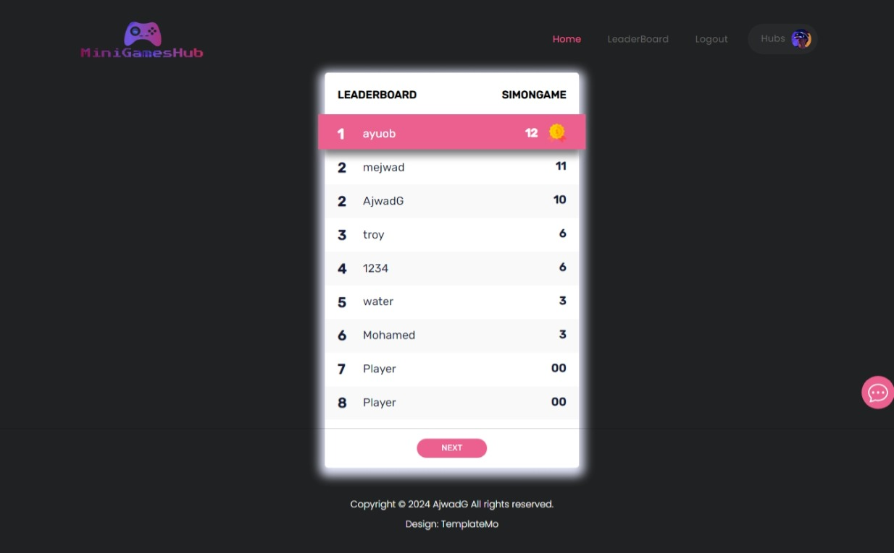

# MiniGamesHub

## Introduction

MiniGamesHub is your one-stop destination for a variety of mini-games, offering big fun all in one place. With an array of entertaining games, MiniGamesHub aims to provide users with endless hours of entertainment and excitement. Whether you're a casual gamer looking for quick thrills or a hardcore enthusiast seeking challenging gameplay, MiniGamesHub has something for everyone.

This web application was created by [Ajwad Elgandouz](https://www.linkedin.com/in/ajwad-algandouz/).

### Links

- **Deployed Site:** [MiniGamesHub](https://minigameshub.onrender.com/)
- **Final Project Blog Article:** [Read Here](#)

## Project Information

MiniGamesHub is a sophisticated web application crafted using JavaScript, Node.js, Express.js, and Socket.IO. It offers an immersive gaming experience by seamlessly integrating modern web technologies.

### Global Chat

The global chat functionality is powered by Socket.IO, enabling real-time communication among users. Each page within MiniGamesHub has its own dedicated chat room. Users within a hub engage in focused discussions, fostering community interaction and engagement.

### Games

- **Simon Game**: A dynamic and visually appealing game featuring randomized sequences and engaging animations, providing players with an entertaining challenge.

- **Trivia Quiz**: Utilizes a public API on the client-side to deliver a diverse range of trivia questions, offering users an intellectually stimulating gaming experience.

- **Wordle**: Implements file storage with a meticulously curated collection of 1000 words, enriching the gameplay experience with varied word lengths and challenging puzzles.

- **Flappy Bird**: Serves as a robust testing ground for collision algorithms, ensuring seamless gameplay experiences across all MiniGamesHub offerings.

- **Rock Paper Scissors**: Seamlessly integrates multiplayer functionality, allowing users to engage in thrilling head-to-head matches with friends and opponents from around the world.

- **Tic Tac Toe**: Features sophisticated multiplayer capabilities and leverages the powerful miniMax algorithm to provide users with challenging AI opponents, enhancing gameplay depth and complexity.

Each game within MiniGamesHub is meticulously crafted to deliver unparalleled entertainment and engagement, making it a premier destination for gaming enthusiasts.

## Features

- User-friendly interface
- Multiple mini-games to choose from
- Real-time global chat functionality powered by Socket.IO
- Leaderboard to track high scores
- Interactive hubs for game selection

## Installation

To install MiniGamesHub, follow these steps:

1. Clone the repository: `git clone https://github.com/your-username/MiniGamesHub.git`
2. Navigate to the project directory: `cd MiniGamesHub`
3. Install dependencies: `npm install`

## Usage

To start the application, run the following command:

```bash
npm run dev
```

To access the MiniGamesHub application, follow these steps:

1. Navigate to [http://localhost:3000](http://localhost:3000) in your web browser.

## Contributing

Contributions to MiniGamesHub are welcome! If you'd like to contribute, please follow these guidelines:

1. Fork the repository.
2. Create a new branch: `git checkout -b feature-name`.
3. Make your changes and commit them: `git commit -m 'Add new feature'`.
4. Push to the branch: `git push origin feature-name`.
5. Submit a pull request.

## Related Projects

Check out these related projects:

- [minigames](https://www.minigames.com/)
- [poki](https://poki.com/en/minigames)

the main difference is the hubs and global Chat

## Licensing

This project is licensed under the MIT License. See the [LICENSE](LICENSE) file for details.

## Screenshots

### Home Page


### Hubs


### Leaderboard



### Games

1. Flappy Bird 
2. Simon Game 
3. Rock Paper Scissors 
4. Tic Tac Toe 

5. Trivia Quiz Game


6. Wordle


